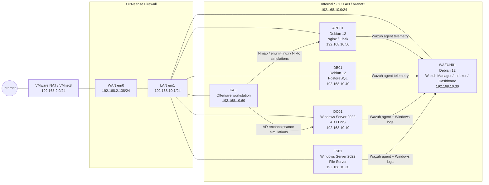

# Network Architecture Diagram

## Logical topology

## IP plan

| Host | Role | IP |
|---|---|---|
| OPNsense LAN | Firewall gateway | 192.168.10.1 |
| DC01 | Active Directory / DNS | 192.168.10.10 |
| FS01 | File server | 192.168.10.20 |
| WAZUH01 | SIEM | 192.168.10.30 |
| DB01 | PostgreSQL | 192.168.10.40 |
| APP01 | Nginx / Flask | 192.168.10.50 |
| KALI | Offensive workstation | 192.168.10.60 |

## Security logic

- OPNsense provides the LAN gateway and outbound NAT.
- Wazuh collects endpoint telemetry from Linux and Windows agents.
- Kali is used only as an internal lab attacker.
- APP01 and DB01 simulate exposed internal Linux services.
- DC01 simulates a Windows enterprise identity backbone.
- The lab validates offensive activity detection through Wazuh and MITRE ATT&CK mapping.
